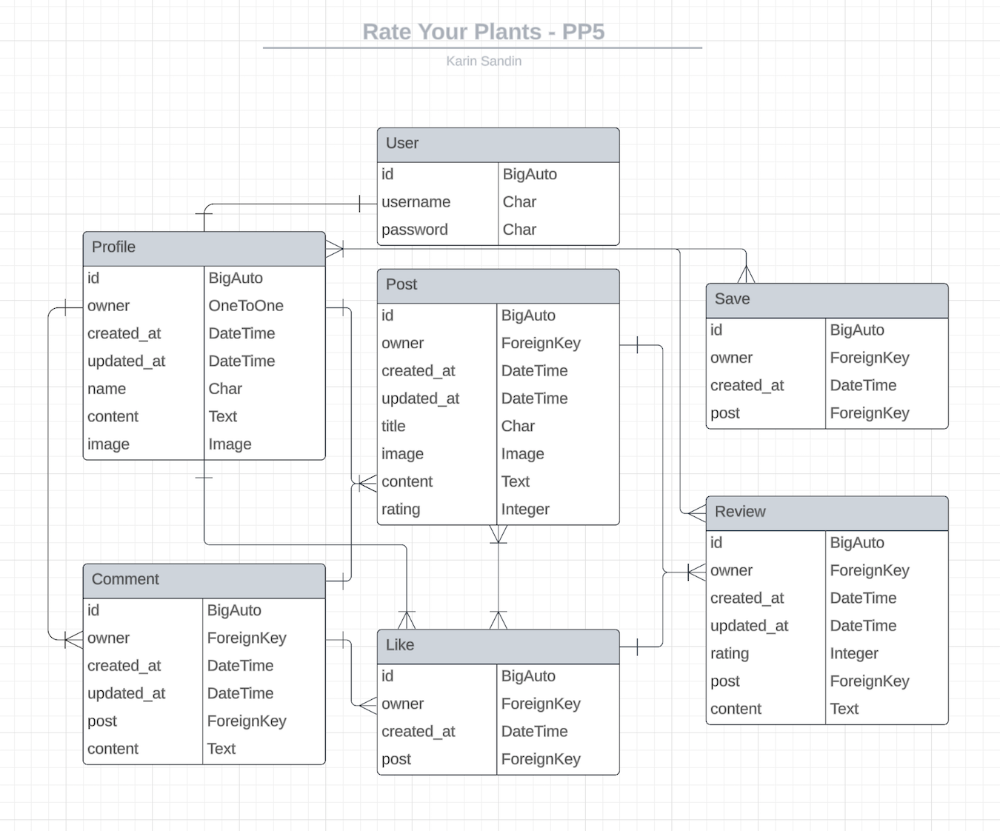

# **Rate Your Plants API**

This is a social media platform for plant lovers! One can create an account, post pictures of their favorite plants with information about them as well as rate them in order of difficulty to care for. A signed in user can also save other users posts in order to keep a sort of “wish list” of plants.

This project is the final of 5 projects that need to be completed to receive a diploma in Fullstack Software Development from The Code Institute.


A live version of this API will be found here: https://ryp-api.herokuapp.com/

* Deployed FrontEnd - https://rate-your-plants.herokuapp.com/

* Deployed BackEnd API - https://ryp-api.herokuapp.com/

* BackEnd Repo - https://github.com/Krnsand/ryp-api

* FrontEnd Repo - https://github.com/Krnsand/rate-your-plants


## **Table of Contents** ##

* [Database Schema](#database-schema)
* [User Stories](#user-stories)
* [Testing](#testing)
    * [Unit Testing](#unit-testing)
    * [Validators](#validators)
    * [Manual Testing](#manual-testing)
* [Technologies Used](#technologies-used)
    * [Languages](#languages)
    * [Libraries, Frameworks, and Programs](#libraries-frameworks-and-programs)
* [Bugs](#bugs)
    * [Unresolved](#unresolved)
* [Deployment](#deployment)
* [Credits](#credits)
    * [Sources](#sources)
    * [Acknowledgments](#acknowledgments)
    * [Media](#media)


------------------------------------------------------------------------------------------------------------


## **Database Schema**



- The "saved" model was added later in the project.


## **User Stories**

- The user stories for this project can be found here: [User Stories](https://github.com/Krnsand/rate-your-plants/issues)

## **Testing**

### **Unit Testing**
#### **Posts List View testing:**
- These tests were possible thanks to the guide of the Moments walkthrough.


- All tests passed by using the command:
 
    *python manage.py test*

#### **Posts Detail View testing:**
- These tests were possible thanks to the guide of the Moments walkthrough.


- All tests passed by using the command:
 
    *python manage.py test*

### **Validators**

- All code passes through the built-in package, similar to PEP8 checker, and was continuously checked throughout the production of this API.

### **Manual Testing**


#### **Testing URLs**

| **URL** | **Passed** |
| --- | --- |
| root | ✅ |
| /profiles/ | ✅ |
| /profiles/:id/ | ✅ |
| /posts/ | ✅ |
| /posts/:id/ | ✅ |
| /posts/create/ | ✅ |
| /followers/ | ✅ |
| /followers/:id/ | ✅ |
| /saved/ | ✅ |
| /saved/:id/ | ✅ |
| /reviews/ | ✅ |
| /reviews/:id/ | ✅ |


## **Technologies Used**

### **Languages**

- Python
- Django
- Django Rest Framework

### **Libraries, Frameworks, and Programs**

- Cloudinary Storage
- Django rest auth
- PostgreSQL
- Pillow 
- Django rest framework
- LucidChart (for the database schema diagram)
- Django Cors Headers

## **Bugs**
### **Unresolved**

- As I used the very helpful Code Institute walkthrough as a guide and had fellow students' posts on the Slack forum, any issue I came across was quickly resolved. And nothing major to report or that still exists.


## Deployment

### Local Deployment

To test the app locally, the terminal within VScode was used. The steps to run this:

* In your project workspace folder, open a terminal
* Run the command: ```python3 manage.py runserver```
* Hit the 'open browser' button or visit ```http://localhost:8000``` in the browser.
* Use the website as usual.
 
### Production Deployment Initial

Before starting the work, the project was deployed to Heroku. This was done early in the process, to prevent having to deal with difficulties of deployment close to the project deadline. The following steps were performed for deployment:

#### Create Heroku app:

* Login in to Heroku
* Create a new app.
* Select "New" and "Create new app".
* Give the new app a name and click "Create new app".
* Select a region (Europe for this app).

#### Connect ElephantSQL Database:

* Log in to ElephantSQL.com to access your dashboard
* Click “Create New Instance”
* Set up your plan: Project name, Select the Tiny Turtle (Free) plan
* Select “Select Region” (EU-North-1 (Stockholm)) for this app
* Then click “Review”
* Click “Create instance”
* Return to the ElephantSQL dashboard and click on the database instance name for this project
* In the URL section, click the copy icon to copy the database URL
* Set up an os.environ["DATABASE_URL"]="<copiedURL>" in the env.py file in your Gitpod repository (which never gets pushed to Gidpod and is thereby safe and secret).

#### Deploy App on Heroku:

* Click "Settings".
* Navigate to the "Config Vars" section and click "Reveal Config Vars"
* Add SECRET_KEY variable
* Add CLOUDINARY_URL variable
* Add DATABASE_URL variables
* Add ALLOWED_HOST variables
* Add CLIENT_ORIGIN_DEV variables
* Add CLIENT_ORIGIN variables
* Add DISABLE_COLLECTSTATIC : 1 (until final deployment, then delete that config var)
* Under "Deployment Method" click on "GitHub" to get access to your repository.
* Enable Automatic Deploys" or click "Deploy Branch" to deploy your app.


## **Credits**

### **Sources**

- The DRF API walkthrough from Code Institue was used as a guide for this project, 
it served as a major help in creating this API.
- [YouTube](https://www.youtube.com/)
- [Stack Overflow](https://stackoverflow.com/)
- [Slack](https://www.slack.com/) - for helpful tips from fellow students!

### **Acknowledgments**
- My mentor at Code Institute - Martina Terlevic.
- Tutor Support
- My friend Viktor Hesselbom

### **Media**
- The media for this API consists of the default images, sourced through google and uploaded on Cloudinary.


Thank you!

[Back to top](#rate-your-plants-api)
